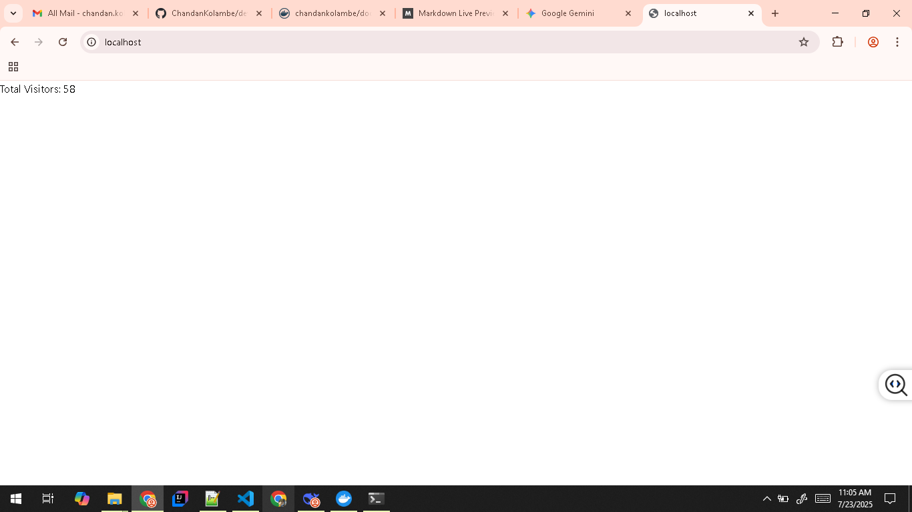
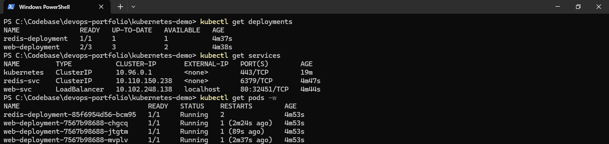
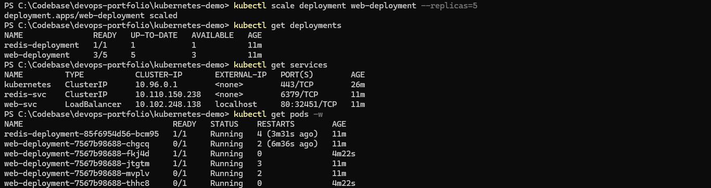

# 🚀 Kubernetes Visitor Counter Project  
**Flask + Redis app demonstrating key Kubernetes concepts**  

[](https://kubernetes.io/)  
[](https://www.docker.com/)

---

## 🛠️ Prerequisites  
1. **Docker Desktop** ([Download](https://www.docker.com/products/docker-desktop))  
   - Enable Kubernetes in Settings  
2. **kubectl** (included with Docker Desktop)  
3. **Git** ([Download](https://git-scm.com/))  

---
## Screenshots



---

## 🚀 Quick Start  

### 1. Clone the Project  
```bash
git clone https://github.com/ChandanKolambe/devops-portfolio.git
cd devops-portfolio/kubernetes-demo
```

### 2. Build and Push Docker Image
```bash
docker build -t chandankolambe/k8s-demo-web:latest ./app
docker push chandankolambe/k8s-demo-web:latest
```

### 3. Deploy to Kubernetes
```bash
kubectl apply -f manifests/
```

### 4. Access the application
```bash
kubectl get service web-svc
```

### 5. Scale the Application
```bash
kubectl scale deployment web-deployment --replicas=5
```

### 6. Perform Rolling Update
```bash
kubectl set image deployment/web-deployment web=chandankolambe/k8s-demo-web:v2
kubectl rollout status deployment/web-deployment
```

### 7. View Logs
```bash
# Web application logs
kubectl logs -l app=web --tail=50

# Redis logs
kubectl logs -l app=redis
```

### 8. Monitor Resources
```bash
kubectl get all                          # All resources
kubectl get pods -w                      # Watch pod status
kubectl describe deployment web-deployment  # Detailed info
```

### 9. Cleanup
```bash
# Delete all resources
kubectl delete -f manifests/

# Optional: Full reset
docker system prune -a
```