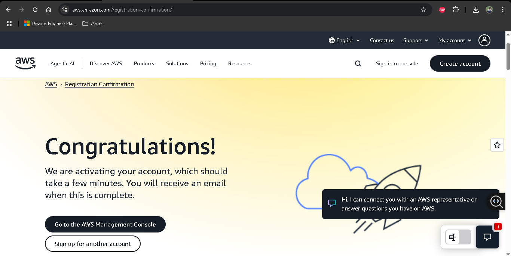
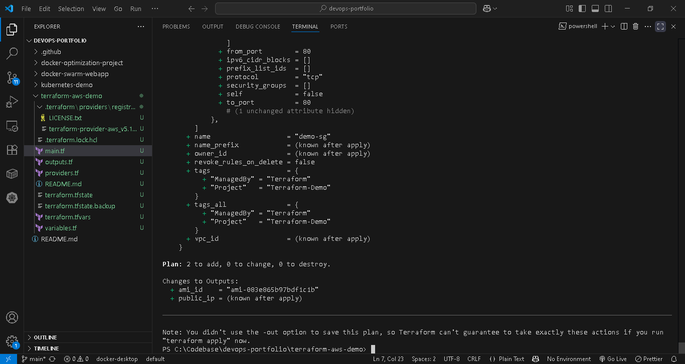

# **Terraform AWS EC2 Free Tier Demo**  

## **Prerequisites**  
1. **Git** ([Download](https://git-scm.com/downloads))  
2. **Terraform** ([Install Guide](https://developer.hashicorp.com/terraform/tutorials/aws-get-started/install-cli))  
3. **AWS Free Tier Account** ([Sign Up](https://aws.amazon.com/free/))
<details>
<summary>📷 <b>Click to view AWS Free Tier setup (5 screenshots)</b></summary>

| Step | Screenshot | Description |
|------|------------|-------------|
| 1 |  | AWS Free Tier page |
| 2 |  | Sign up |
| 3 |  | Password creation |
| 4 |  | Identity confirmation |
| 5 |  | Free Tier confirmation |
</details>

4. **AWS CLI** (Optional) ([Install Guide](https://docs.aws.amazon.com/cli/latest/userguide/getting-started-install.html))  

---

## **Step-by-Step Setup**  

### **1. Clone the Project**  
```bash
git clone https://github.com/ChandanKolambe/devops-portfolio.git
cd devops-portfolio/terraform-aws-demo
```

---

### **2. Set Up AWS Account**  
#### **A. Create an IAM User (Avoid Root Account!)**  
1. Go to **AWS IAM Console** → **Users** → **Create User**.  
2. Enter a name (e.g., `terraform`).  
3. Select **Attach Policies Directly** → Add `AdministratorAccess`.  
4. Click **Create User**.  

#### **B. Generate Security Credentials**  
1. Under the user’s **Security Credentials** tab, click **Create Access Key**.  
2. Choose **CLI** and acknowledge the warning.  
3. **Download the `.csv` file** (contains `AWS_ACCESS_KEY_ID` and `AWS_SECRET_ACCESS_KEY`).  

#### **C. Create an SSH Key Pair**  
1. Go to **EC2 Console** → **Key Pairs** → **Create Key Pair**.  
2. Name: `my-key-pair` → Type: `RSA` → Format: `.pem` (Linux/Mac) or `.ppk` (Windows).  
3. Click **Create Key Pair** (auto-downloads the private key).  
4. Move the key to `~/.ssh/` (Linux/Mac) or `C:\Users\YourUser\.ssh\` (Windows).
<details>
<summary>📷 <b>Click to view IAM & Key Pair setup (2 screenshots)</b></summary>

| Step | Screenshot | Description |
|------|------------|-------------|
| 1 |  | IAM user "terraform" created |
| 2 |  | EC2 key pair "terraform-key" created |

</details>
---

### **3. Configure AWS Credentials**  
#### **Option A: Use AWS CLI (Recommended)**  
1. Install AWS CLI:  
   ```bash
   aws configure
   ```
2. Enter:  
   - `AWS Access Key ID`: From the downloaded `.csv`.  
   - `AWS Secret Access Key`: From the `.csv`.  
   - `Default Region`: `us-east-1` (Free Tier-friendly).  
   - `Default Output Format`: `json`.  

#### **Option B: Hardcode in `providers.tf` (For Testing Only)**  
```hcl
provider "aws" {
  region     = "us-east-1"
  access_key = "YOUR_ACCESS_KEY"   # Replace with your key
  secret_key = "YOUR_SECRET_KEY"   # ⚠️ Never commit this to Git!
}
```

---

### **4. Initialize Terraform**  
```bash
terraform init
```
<details>
<summary>📷 <b>Click to view initialization (1 screenshot)</b></summary>

| Step | Screenshot | Description |
|------|------------|-------------|
| 1 |  | `terraform init` output |

</details>
---

### **5. Deploy the EC2 Instance**  
```bash
terraform plan
terraform apply  # Type "yes" to confirm
```
<details>
<summary>📷 <b>Click to view deployment (7 screenshots)</b></summary>

| Step | Screenshot | Description |
|------|------------|-------------|
| 1 |  | First `terraform plan` |
| 2 |  | Plan details |
| 3 |  | `terraform apply` confirmation |
| 4 |  | Apply complete |
| 5 |  | `terraform output` showing IP |
| 6 |  | EC2 Dashboard |
| 7 |  | EC2 instance in "running" state |

</details>

<details>
<summary>📷 <b>Click to view tainting (3 screenshots)</b></summary>

| Step | Screenshot | Description |
|------|------------|-------------|
| 1 |  | `terraform taint aws_instance.demo` |
| 2 |  | Terraform Plan |
| 3 |  | Plan showing replacement needed |

</details>
---

### **6. Destroy Resources (Avoid Costs!)**  
```bash
terraform destroy
```
<details>
<summary>📷 <b>Click to view destruction (6 screenshots)</b></summary>

| Step | Screenshot | Description |
|------|------------|-------------|
| 1 |  | `terraform destroy` confirmation |
| 2 |  | Destroy in progress |
| 3 |  | Destroy complete |
| 4 |  | Resources removed |
| 5 |  | Instance in "Terminated" state |
| 6 |  | Resources fully removed |

</details>
---

## **📸 Screenshot Gallery** <a id="screenshot-gallery"></a>
For all screenshots in one place:  
[View Full Gallery](screenshots/)  
*(Organized by step in `/screenshots/` folder)*

---